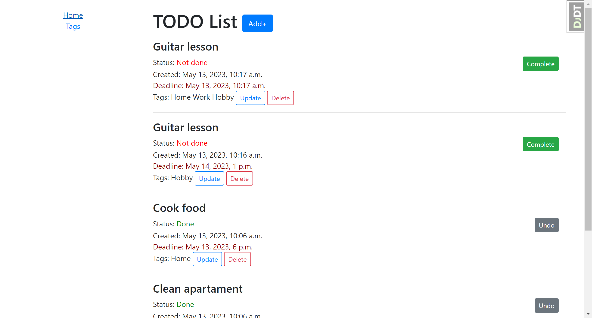

# ToDo List project
> In this practice project, I implemented a todo list site.
## Why beginners should make a ToDo List practice?
* ToDo is super helpful for beginners.
* Any Django project needs a database and for that you must know how to handle databases in Django, making a To-Do app makes us learn basic database operations like CRUD i.e. Create, Read, Update and Delete.
* It's fun!

## Installation

Python3 must be already installed.

```shell
git clone https://github.com/MKeSiMu/todo-list-practice.git
cd company-webpage
python3 -m venv venv
source venv/bin/activate
pip install -r requirements.txt
python manage.py runserver
```

## Features

* Ability to create/update/delete task  and add multiple tags on it;
* All tasks ordered from not done to done and from newest to oldest;
* Added a button Complete if a task is not done and Undo if a task is done, this button changes the status of the task to the opposite and redirects to this page..

## Demo


